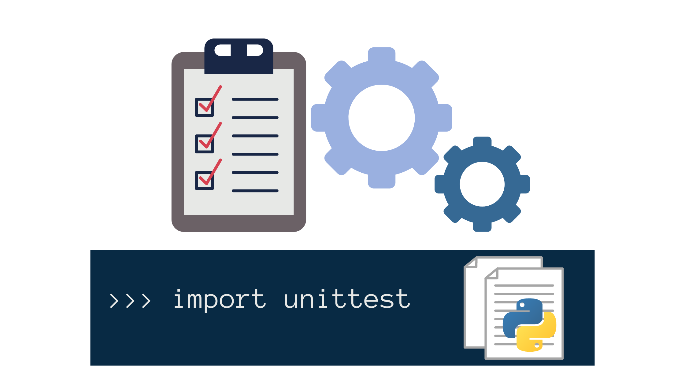

# unitest 
> "Trust, but Verify(with unittest 😁😅)"




## definition:
The unitest in python is a tiny code snippet that verifies a single aspects of your code's functionality.it is like a detective that checks if your functions and classes are doing what they're supposed to.
Unit testing framework was originally inspired by JUnit and has a similar flavor as major unit testing frameworks in other languages.
Unittest support some important concepts in an object-oriented way:
- Text Fixture: 
Represents the preparation needed to perform one or more tests, such as setting up preconditions or initializing ressources, 'unittest' provides methods like 'SetUp()' and 'tearDown()' to create and clean up fixturs.
- Test runner:
The module that run the unit testing(unittest, pytest), the runner may use a Graphic Interface, a Textual Interface or return a special value to incate the results of executing the tests.
- Test Case:
The smallest and individual Unit of testing, it checks for a specific response to a particular set of inputs. unittest provides a base class, TestCase, which may used to create new test cases, this class use Asserts methods to check for actions and responses.
- Test suit:
A collection of test cases, it is groupes together for the purpose of running them collectively. In Python's unit testing framework, a test suit can contain multiple test cases organized into classes or modules.


## Command-Line Interface
- run tests with more detail (higher verbosity) by passing in the -v flag:
```bash 
python -m unittest -v test_module
```
- For a list of all the command-line options:
```bash
python -m unittest -h
```